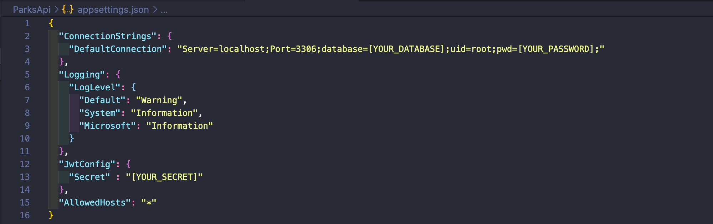
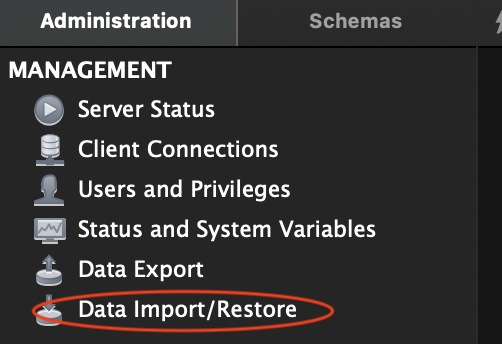
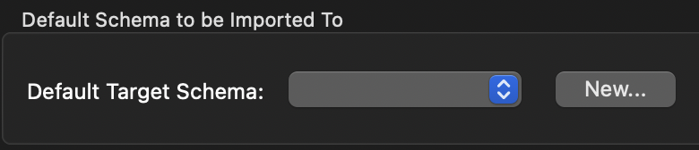

# _Park Finder: Go out and explore!_

#### _An API that lists state parks, national parks and their associated reviews_

#### By _**Chloe Loveall**_
<br>

 &nbsp;  &nbsp;  &nbsp;  &nbsp;  &nbsp; 

## Table of Contents

1. [Table of Contents](#table-of-contents)
2. [Description](#description)
3. [Preview](#preview)
4. [Technologies Used](#technologies-used)
5. [Setup and Installation Requirements](#setup-and-installation-requirements)
    * [Prior to Installation](#prior-to-installation)
      * [Git Installation](#confirm-you-have-git-installed)
      * [.NET Installation](#confirm-you-have-.net-installed)
    * [Installation](#installation)
    * [Database Setup](#database-setup)
      * [MySQL Password Protection](#mysql-password-protection)
      * [Entity Framework Core Database Setup](#entity-framework-core-database-setup)
    * [Launching the Program](#launching-the-program)
6. [User Stories](#user-stories)
7. [Specifications](#specifications)
8. [Known Bugs](#known-bugs)
9. [Issues](#issues)
10. [Roadmap](#roadmap)
11. [Design](#design)
12. [Contributing](#contributing)
13. [License](#license)
14. [Acknowledgements](#acknowledgements)
15. [Contact Information](#contact-information)

## Description

An API that functions as a state and national park database. It utilizes RESTful principles, version control, and has integrated JWT token-based authentication. The parks and reviews have full CRUD functionality; users can view, add, update and delete national/state park entries and reviews. All API endpoints can be view via the swagger UI (more on that in the API Documentation section).

## Preview

Live preview with AWS or Azure - not yet deployed 

## Technologies Used

* ASP.NET Core Authentication 5.0.4
* ASP.NET Core Identity 5.0.4
* ASP.NET Core MVC 5.0.1
* ASP.NET Core MVC Versioning 5.0.0
* C#
* Entity Framework 5.0.4
* MySQL 8.0.15
* MySQL Workbench 8.0.15
* Postman 8.0.10
* Swashbuckle ASP.NET Core 5.6.3 (for Swagger)

## Setup and Installation Requirements

### Prior to Installation

#### Confirm you have Git installed
  * Installing Git on Macs:
    * Install the package manager [Homebrew](https://brew.sh/) by copying and pasting the following in the terminal: ```$ /usr/bin/ruby -e "$(curl -fsSL https://raw.githubusercontent.com/Homebrew/install/master/install)"```
    * Copy and paste once of the following lines in the terminal so that Homebrew packages are run before the system versions of the same packages:
      * For bash users: ```$ echo 'export PATH=/usr/local/bin:$PATH' >> ~/.bash_profile```
      * For zsh users: ```$ echo 'export PATH=/usr/local/bin:$PATH' >> ~/.zshrc```
    * Last, install Git with the following terminal command: ```$ brew install git```

  * Installing Git on Windows:
    * Open Command Prompt, the Windows terminal program. You can access it by typing ```Cmd``` in the search bar in the bottom left corner.
    * **NOTE** There are many options available, but we recommend using a free program called [Git Bash](https://gitforwindows.org/)
    * Navigate to [Git Bash](https://gitforwindows.org/) and click on the Download button. This will take you to a page with the latest version of Git Bash. Determine whether you have 32-bit or 64-bit Windows by following these instructions. Then download the corresponding exe file from the Git for Windows site. (If you have a package manager already installed, you can also choose to download the tar.bz2 version.)
    * Click on the downloaded file and then follow the instructions in the Setup menu until you reach the Install button and install the package.
    
#### Confirm you have .NET installed 
Installing .NET will provide provide access to the C# language
  * [.NET for macOS](https://dotnet.microsoft.com/download/dotnet/thank-you/sdk-5.0.100-macos-x64-installer)
  * [.NET for Windows](https://dotnet.microsoft.com/download/dotnet/thank-you/sdk-5.0.102-windows-x64-installer)
* Additionally, you may want to install a REPL to allow you to practice, test, and experiment with C#. Below are instructions for the ```dotnet script``` REPL:
  * Install ```dotnet script``` by running the following terminal command: ```$ dotnet tool install -g dotnet-script```
  * **NOTE:** If you just installed .NET 5, restart the terminal. (Otherwise, you will not be able to run the following command.) 
    * Enter ```$ dotnet script``` in your terminal and a prompt will open: ```>```
    * To exit the REPL press: Ctrl +C

#### Confirm you have Postman Installed
**NOTE**: This step is not required, but it is recommended for testing the API
* Navigate to [Postman](https://www.postman.com/downloads/)
  * For macOs: Click the ```Download the App``` button to download and install
  * For Windows: Click the ```Download for Windows x32``` or ```Download for Windows x64``` link to download and install

### Installation

#### Clone
* Clone the repository with the following git terminal command: ```$ git clone https://github.com/chloeloveall/ParksApi.Solution.git```
* Open the project's root directory (```ParksApi.Solution```) in your terminal
* Navigate to the ```ParksApi``` directory (the production directory)
    * To create an ```obj``` directory and install dependencies, run the terminal command: ```$ dotnet restore```
    * **NOTE**: Do not touch the code in the ```obj``` directory

#### Download
* Open the repository on GitHub: [chloeloveall/ParksApi.Solution](https://github.com/chloeloveall/ParksApi.Solution)
* Click ```Code``` button and select ```Download ZIP```
* Open and extract the files
* Open [VSCode], or your code editor of choice
* Select ```File>Open...``` and navigate to the unzipped file folder 
* Select ```ParksApi.Solution``` and click ```open``` to view the project

### Database Setup 

#### MySQL Password Protection
* Create the following file in the ```ParksApi``` directory (the production directory): ```appsettings.json```
* Add the following code: 


* **NOTE**: [YOUR_DATABASE] must match the database name you chose to import above
* **NOTE**: [YOUR_PASSWORD] must match your local MySQL server password
* **NOTE**: [YOUR_SECRET] can be randomly generated at [BrowserLing](https://www.browserling.com/tools/random-string) and then copied and pasted into your ```appsettings.json```
* **NOTE**: The port should match the ```Local instance``` you have selected in MySQL Workbench
* **NOTE**: The ```appsettings.json``` file is included in the ```.gitignore``` file 
  * You can read more about best practices for storing private information with ASP.NET Core [here](https://www.humankode.com/asp-net-core/asp-net-core-configuration-best-practices-for-keeping-secrets-out-of-source-control)

  Change the server, port, and user id as necessary. Replace 'YourPassword' with relevant MySQL password (set at installation of MySQL).

#### Entity Framework Core Database Import
* Confirm you have [MySQL](https://dev.mysql.com/downloads/file/?id=484914) installed
* Confirm you have [MySQL Workbench](https://dev.mysql.com/downloads/file/?id=484391) installed
* From the production directory (```ParksApi.Solution/ParksApi```), run this command: ```dotnet ef database update```
* Open MySQL Workbench and verify that there is a new database with the database name you specified in the ```appsettings.json``` file
* (Optional) To update the database with any changes to the code, run this command: ```dotnet ef migrations add <MigrationsName>``` 
  * This will use Entity Framework Core's code-first principle to generate a database update
  * Next, run the previous command ```dotnet ef database update``` to update the database.

#### MySQL Workbench Database Import
* Open ```MySQL Workbench``` and select ```Local Instance 3306```
* In the ```Administration``` tab, select ```Data Import/Restore``` 


* Select ```Import from Self-Contained File```
* Select the file ```chloe_loveall.sql``` from the ```ParksApi.Solutions``` root directory
* Select ```New``` from the ```Default Schema to be Imported To``` section 


* Choose a name for the database and select ```Ok```
* Select ```Start Import```

### Launching the program
* You are now ready to run the program! To launch the program, navigate to the production directory (ParksApi.Solution/ParksApi) and run the following terminal command: ```dotnet run```
* **NOTE**: You can alternately use ```dotnet watch run``` if you would like to make and view changes without needing to relaunch ```dotnet run```
* In the browser of your choice, navigate to: ```http://localhost:5000/``` or you can access the API in Postman
  * You can test the API call and explore endpoints (more information on endpoints below)

## API Documentation
Explore the API endpoints in Postman or a browser. You will not be able to utilize authentication in a browser.

### Versioning


### JWT Token Based Authentication

### Swagger 
To explore the Park Finder API with Swagger, launch the project using the terminal command ```dotnet run```, and input the following URL into your browser: ```http://localhost:5000/swagger```

## User Stories

* As a user, I want to GET, POST, PUT, and DELETE information about state and national parks
*	As a user, I want to GET, POST, PUT, and DELETE reviews about state and national parks

## Specifications

| Behavior                                                         | Input                      | Output                     |
| ---------------------------------------------------------------- | :------------------------- | :------------------------- |

## Known Bugs

* Swagger does not have authorization enabled. Endpoints can be viewed, but the "Try it out" feature is not accessible.

## Issues

* Report issues [here](https://github.com/chloeloveall/ParksApi.Solution/issues) and select the ```New issue``` button
for support and

## Roadmap

* Add authorization to swagger UI
* Add a ```RANDOM``` endpoint that randomly returns a park
* Add a second custom endpoint that accepts parameters. Example: a ```SEARCH``` route that allows users to search by specific park names
* Build a client that utilizes the API

## Contributing

Contributions are what make the open source community such an amazing place to be learn, inspire, and create. Any contributions you make are greatly appreciated.

1. Fork the project on GirHub
    * Follow [Installation and Setup Requirements](#setup-and-installation-requirements) above
2. Create your Feature Branch: ```$ git checkout -b YourFeatureBranchName```
3. Commit your Changes ```$ git commit -m 'Add some Amazing Feature'```
4. Push to your feature branch on Github ```$ git push origin YourFeatureBranchName```
5. Open a Pull Request

## License

[MIT](LICENSE.md)

## Acknowledgements

* [API Authentication with JWT Tutorial](https://dev.to/moe23/asp-net-core-5-rest-api-authentication-with-jwt-step-by-step-140d)
* [BrowserLing](https://www.browserling.com/tools/random-string)
* [Canva](https://www.canva.com/)
* [Choose an open source license](https://choosealicense.com/)
* [Microsoft C# Documentation](https://docs.microsoft.com/en-us/dotnet/csharp/)
* [Shields](https://shields.io/)

## Contact Information

_Chloe Loveall <chloeloveall@protonmail.com>_

 &nbsp;  &nbsp; 

[Back to Top](#table-of-contents)